<!-- main hero banner (animated) -->

<table border="0">
<tr>
<td width="32%" align="center" valign="middle">

`▸ ./bawbaw --status: undead & deploying`

</td>
<td width="68%" align="center" valign="middle">

 

</td>
</tr>
</table>

&nbsp;

&nbsp;

&nbsp;

&nbsp;

---

## `$ whoami`

system snapshot &amp; career sheet — who's behind the terminal

  

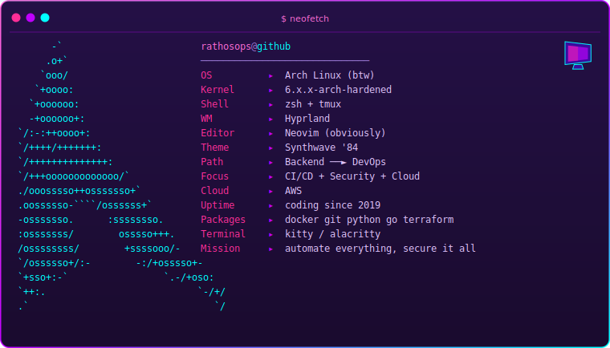

  

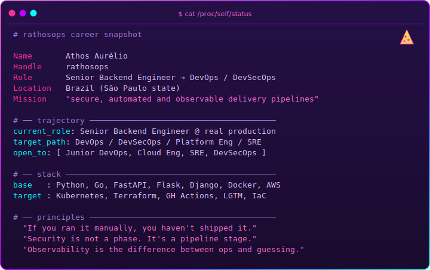

---

## `$ ls -la /usr/bin/stack`

the toolbox — what I build, ship and secure with

  

<table>
<tr>
<td align="center" width="50%">

**`// backend.core`**

</td>
<td align="center" width="50%">

**`// devops.runtime`**

</td>
</tr>
<tr>
<td align="center">

**`// cloud.pipeline`**

</td>
<td align="center">

**`// data.storage`**

</td>
</tr>
<tr>
<td align="center" colspan="2">

**`// workstation`**

</td>
</tr>
</table>

---

## `$ cat ~/.pipeline.yml`

my secure-delivery standard — from lint to signed image

  

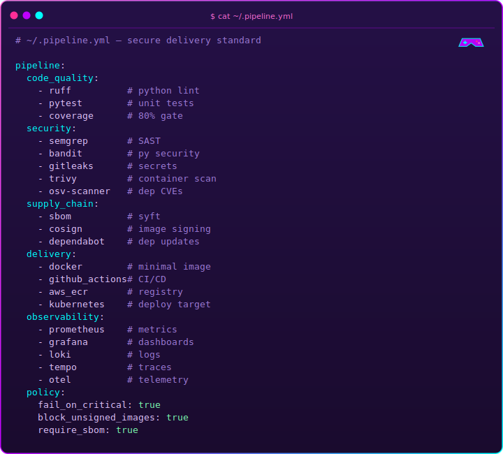

---

## `$ htop`

what's running now — active projects &amp; labs

  

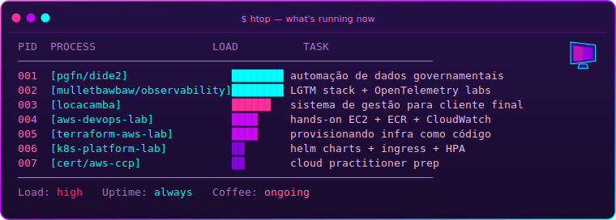

---

## `$ tree ~/devops-labs`

the lab bench — hands-on repos, annotated

  

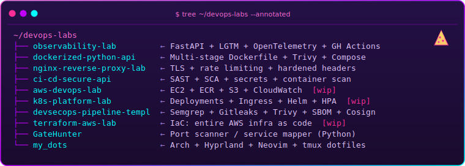

---

## `$ journalctl -f /var/log/mission-2026.log`

the roadmap — what ships next, in order

  

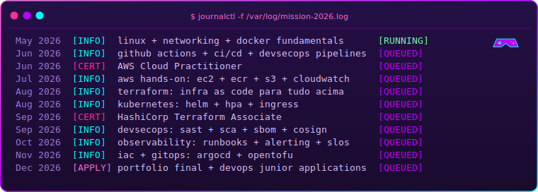

---

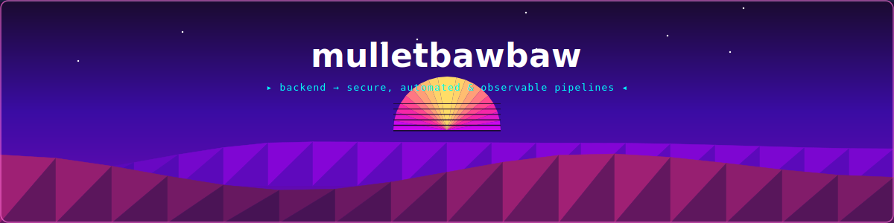

## `$ cat /proc/github`

<!-- Self-hosted vaporwave cards — generated by scripts/gen_profile.py in CI and
     committed to this repo (see .github/workflows/profile.yml). No Vercel/Demolab,
     no 429: the README serves static SVGs from the repo itself. -->

the numbers — rendered as an RPG character sheet

  

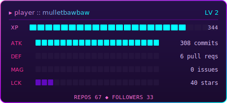
&nbsp;
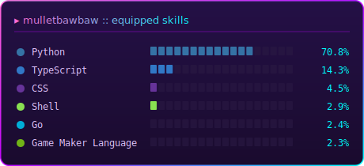

  

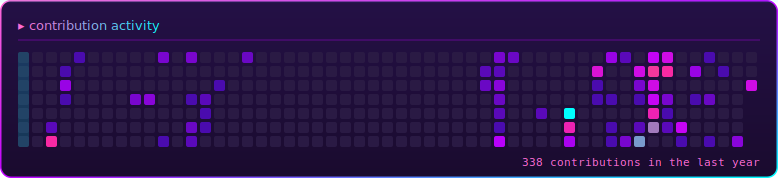

---

## `$ render --isometric ~/.contributions`

<!-- 3-D isometric "city" of contributions — towers rise with daily commit volume.
     100% self-hosted: generated by scripts/svgkit.py:iso_city in CI and committed
     to this repo (no third-party render service, no 429), matching every other
     asset's vaporwave palette. -->

<picture>
  <source media="(prefers-color-scheme: dark)" srcset="https://raw.githubusercontent.com/mulletbawbaw/mulletbawbaw/output/github-contribution-grid-snake-dark.svg" />
  <source media="(prefers-color-scheme: light)" srcset="https://raw.githubusercontent.com/mulletbawbaw/mulletbawbaw/output/github-contribution-grid-snake.svg" />
  
</picture>

---

## `$ ./snake.sh --render`

the snake eats the contribution grid

  

<picture>
  <source media="(prefers-color-scheme: dark)" srcset="https://raw.githubusercontent.com/mulletbawbaw/mulletbawbaw/output/github-contribution-grid-snake-dark.svg" />
  <source media="(prefers-color-scheme: light)" srcset="https://raw.githubusercontent.com/mulletbawbaw/mulletbawbaw/output/github-contribution-grid-snake.svg" />
  
</picture>

---

## `$ tail -f /var/log/philosophy.log`

the principles — what I refuse to ship without

  

---

## `$ ./connect.sh --all`

open a socket — let's build something secure

  

&nbsp;

&nbsp;

  

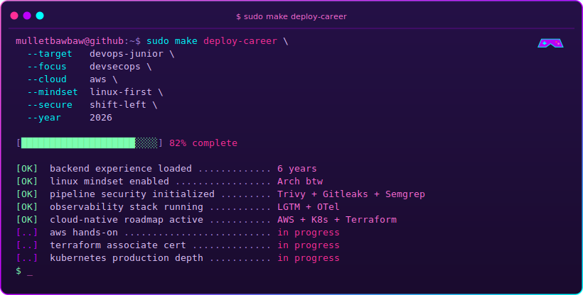

<!--
  ──────────────────────────────────────────────────────────────────────────
  SETUP — todos os assets são self-hosted (sem Vercel/Demolab, sem 429)
  ──────────────────────────────────────────────────────────────────────────

  • Todos os assets (header, stats, languages, contributions, iso, typing,
    footer) + snake são gerados pelo workflow .github/workflows/profile.yml e
    commitados neste repo — sem dependência de terceiros em tempo de render.
  • Gerador próprio low-poly/retro: scripts/ (svgkit.py = primitivas + ícones
    low-poly + cidade isométrica; github_data.py = dados; terminals.py = janelas
    de terminal; gen_profile.py = orquestrador), Python stdlib puro.
  • Para incluir stats privados, adicione o secret PROFILE_TOKEN (PAT classic
    com escopos repo + read:user). Sem ele, mostra apenas dados públicos.
  • Primeiro run: aba Actions → "Generate profile assets" → Run workflow.
    Depois roda sozinho diariamente.
  ──────────────────────────────────────────────────────────────────────────
-->

